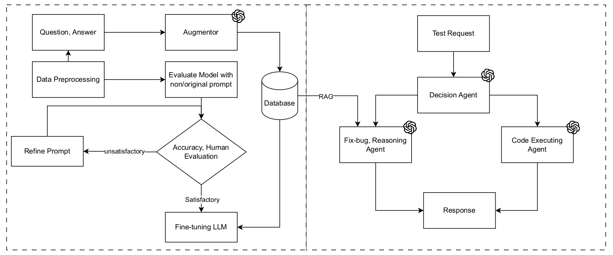

## Multi-Agents LLM for CodeMMLU Challenge

## Abstract
The rapid development of Large Language Models (LLMs) has revolutionized numerous domains, enabling systems to comprehend, generate, and reason over vast amounts of textual data. Among these advancements, the application of LLMs to multiple-choice question answering (MCQs) in programming has garnered significant interest due to its potential to automate coding assessments and enhance educational platforms. However, adapting LLMs to effectively handle MCQs tasks presents challenges, particularly with issues like hallucinations and ambiguous prompts. This work explores the potential of Alibaba's Qwen2.5-Coder, an updated LLM version optimized for coding tasks, for solving multiple-choice programming-based questions. My contributions involve combining fine-tuning techniques and intergrate multi-agents into this challenge on the CodeMMLU dataset. The results demonstrate a notable improvement in the model's ability to handle MCQ tasks, with the accuracy of Qwen2.5-Coder-0.5B rising from 36% to 62% post fine-tuning. This research highlights the effectiveness of leveraging fine-tuning and multi-agents strategies to enhance the performance of LLMs in coding-related MCQs scenarios.

## Proposed Approach 




## Evaluation Results

Results that evaluated on the public and private test dataset with all 1253 multiple-choices code-related questions. 

| Model |Paramaters (B) | Public Test Accuracy (%) |Private Test Accuracy (%)|
|--|--|--|--|
|`Qwen2.5-Coder-Instruct (Baseline)`|7| 54 |53|
|`Qwen2.5-Coder-Instruct (Baseline)` |0.5| 30 |28|
|`Qwen2.5-Coder-Instruct (Fine-tuned)`|0.5| 40 |36|
|`Qwen2.5-Coder-Instruct (Fine-tuned) + RAG`|0.5|50 |52|
|`Multi-agent Qwen2.5-Coder`|0.5|**63** |**62**|

## Running

### Preparation
```bash
git clone https://github.com/giabao804/CodeMMLU_RAG.git
cd CodeMMLU_RAG
```
```bash
conda create -n codellm python=3.10.12 -y
conda active codellm
pip install --upgrade pip
pip install -r requirements.txt
```
### Inference
```bash
python3 inference.py
```